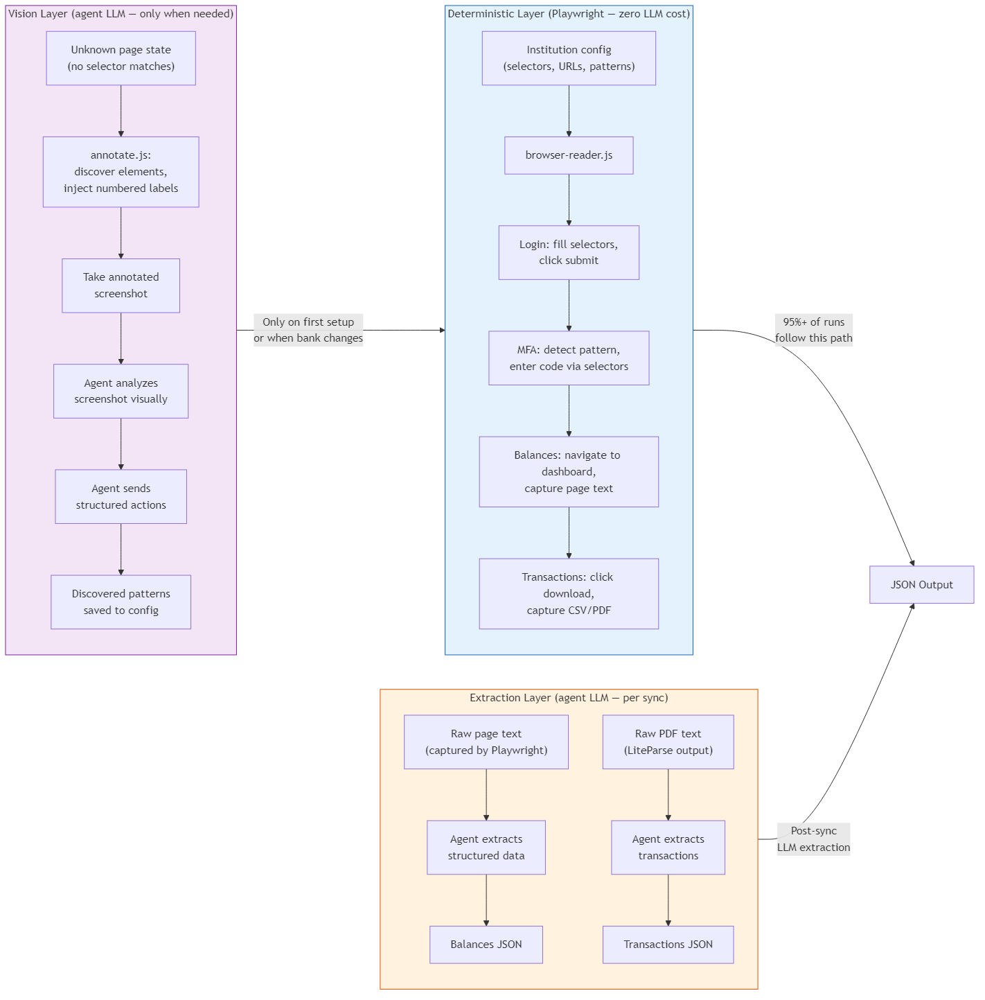
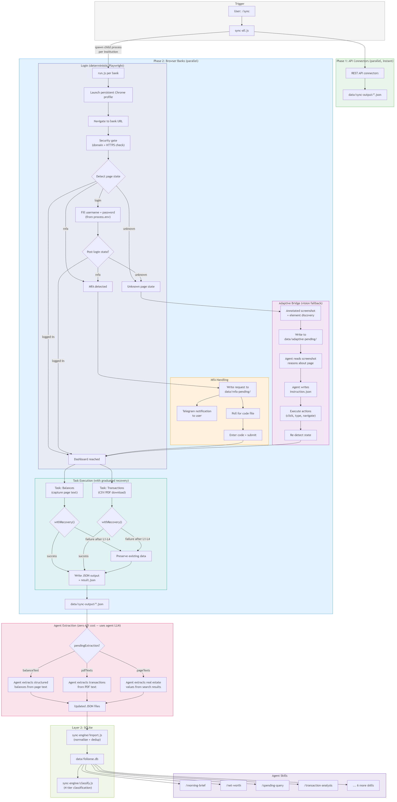
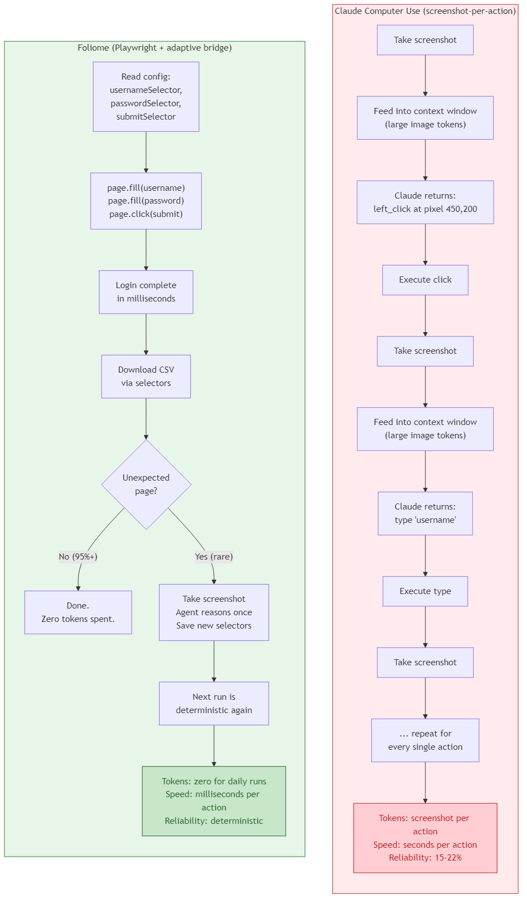

# How Browser Automation Works in Foliome

Foliome does **not** use Claude Computer Use (screenshot-per-action). It uses a hybrid architecture: **deterministic Playwright configs for daily runs** (zero LLM cost), with an **agent vision fallback** for edge cases (unknown page states, bank redesigns). The agent also handles **text extraction** — turning raw page text and PDF content into structured financial data.

This design is intentional. Computer Use sends a screenshot to the API for every click, costing tokens and taking seconds per action at 15-22% reliability. Foliome's approach uses DOM selectors that execute in milliseconds, deterministically, for free — and only involves the agent when something unexpected happens.

## Three Layers

### 1. Deterministic Layer (Playwright — zero LLM cost)

This is where 95%+ of daily runs happen. Each institution has a config file with:
- Login selectors (username field, password field, submit button)
- MFA detection patterns and handler selectors
- Transaction download selectors (one of 6 proven patterns)
- Dashboard URL for navigation recovery

The browser reader (`browser-reader.js`) reads the config and executes Playwright commands directly — `page.fill()`, `page.click()`, `page.waitForEvent('download')`. No screenshots, no vision, no API calls. A full bank sync takes seconds.

### 2. Vision Layer (agent LLM — only when needed)

When Playwright encounters a page it doesn't recognize (no selector matches, state detection returns `'unknown'`), the **adaptive bridge** activates:

1. `annotate.js` discovers all interactive elements on the page and injects numbered labels
2. An annotated screenshot is saved to `data/adaptive-pending/`
3. The orchestrating agent reads the screenshot, reasons about the page, and writes back structured actions
4. The browser executes the actions (click element #3, type in input #7, etc.)
5. Discovered patterns are saved so the **next run is deterministic**

This happens during initial setup (`/learn-institution`) and when a bank redesigns its site. Once the config is updated, the vision layer is no longer needed.

### 3. Extraction Layer (agent LLM — per sync)

Playwright captures raw text (dashboard page content, PDF statement text via LiteParse). The agent extracts structured data from this text:
- **Balance extraction**: raw dashboard text → structured balances with account matching
- **PDF transaction extraction**: raw statement text → structured transactions with dates, amounts, descriptions

This uses the agent's own LLM capabilities (Claude Code's context window) — no external API calls.

## Full Sync Flow

1. **Trigger**: User says `/sync` or runs `node readers/sync-all.js`
2. **Phase 1**: API connectors run in parallel (REST APIs, no browser needed)
3. **Phase 2**: All browser banks launch in parallel, each as a child process:
   - Login via Playwright selectors
   - MFA handling via file-based bridge (codes routed from Telegram)
   - Adaptive bridge for unknown page states (rare)
   - Task execution with graduated error recovery (retry → self-recover → adaptive → skip)
4. **Extraction**: Agent processes `pendingExtraction` data from raw text
5. **Import**: `import.js` normalizes and deduplicates into SQLite
6. **Classify**: 4-tier transaction classifier categorizes new transactions

## How This Compares to Claude Computer Use

| | Foliome | Claude Computer Use |
|---|---|---|
| **Token efficiency** | No tokens spent on automation | Screenshot image tokens per action (burns context/quota fast) |
| **Speed per action** | Milliseconds | Seconds (screenshot → vision analysis → action loop) |
| **Reliability** | Deterministic (selectors work or they don't) | 15-22% on benchmarks |
| **Runs headless** | Yes (CI, background, cron) | No (needs visible desktop, macOS only) |
| **Handles UI changes** | Breaks → adaptive bridge fixes → deterministic again | Handles naturally (but slowly) |
| **Setup cost** | Higher (build config once per institution) | Lower (just point and go) |
| **Daily run cost** | Near-zero (no LLM involvement) | Scales with number of actions |

Computer use in Claude Code is included in Pro/Max subscriptions — it's not a separate API charge. But every screenshot is a large image token payload fed into the context window, which means it consumes your usage allocation significantly faster than text-only tools like Bash or Read.

### Why not Computer Use?

A bank login requires ~15-20 actions (navigate, fill username, fill password, click submit, handle MFA, navigate to download, click export, etc.). With Computer Use, that's 15-20 screenshot-analyze-act cycles at ~1-3 seconds each. Each screenshot is a large image consuming context window space. Multiply by 7 institutions syncing daily — that's a lot of context burned on actions that could be deterministic.

With Playwright, those same 15-20 actions execute in under 5 seconds total, using zero tokens, with deterministic reliability. The agent only gets involved when something breaks — and when it does, the fix is saved so it doesn't break the same way twice.

### The hybrid advantage

Computer Use is "all vision, all the time." Foliome is "never vision, unless you need it — and when you do, learn from it so you don't need it again." The adaptive bridge is conceptually similar to Computer Use (screenshot → agent reasoning → action) but it's a **recovery mechanism**, not the primary execution path.
